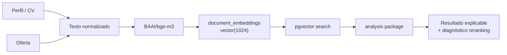

# Datalaburo

Datalaburo es un proyecto de tesis para analizar compatibilidad entre perfiles profesionales/CVs y ofertas laborales tecnológicas.

El enfoque actual es **vector-first**: PostgreSQL + pgvector recupera ofertas cercanas semánticamente con embeddings `BAAI/bge-m3`, y una capa de análisis explica roles, seniority, skills, brechas, evidencia y transferibilidad. El proyecto no busca replicar un ATS por keywords ni vender un porcentaje final como verdad absoluta.

## Contenido

- [Estado actual](#estado-actual)
- [Problema](#problema)
- [Enfoque técnico](#enfoque-técnico)
- [Arquitectura](#arquitectura)
- [Stack](#stack)
- [Funcionalidades](#funcionalidades)
- [Endpoints útiles](#endpoints-útiles)
- [Ejecución local](#ejecución-local)
- [Validación diagnóstica](#validación-diagnóstica)
- [Roadmap](#roadmap)
- [Limitaciones](#limitaciones)
- [Documentación extendida](#documentación-extendida)

## Estado actual

| Área | Estado |
| --- | --- |
| Base objetivo | PostgreSQL + pgvector |
| Base legacy | H2, solo histórico/tests; no es fallback objetivo |
| Modelo real | `BAAI/bge-m3` |
| Dimensión vectorial | `document_embeddings.embedding vector(1024)` |
| Servicio de embeddings | `embedding-service/` con Python + FastAPI |
| App principal | Spring Boot + Thymeleaf |
| Búsqueda vectorial | pgvector con distancia coseno |
| Compatibilidad vector-first | Endpoint interno activo |
| Reranking | Diagnóstico solamente; no reordena resultados |
| Modelo fake | `fake-deterministic-1024`, solo infraestructura/test |

Estrategia actual:

```text
VECTOR_FIRST_WITH_RERANKING_DIAGNOSTIC
```

Esto significa:

- `vectorRank` se conserva como auditoría del ranking semántico original.
- `analysisRank` sigue siendo igual a `vectorRank`.
- `suggestedRerankRank` y `suggestedRankDelta` son diagnósticos.
- No hay reranking real activo.
- No hay score híbrido ponderado como fuente de verdad.

## Problema

Los filtros por keywords son limitados: un CV puede ser cercano a una oferta aunque no use exactamente los mismos términos, y también puede compartir keywords sin ser una oportunidad profesional razonable.

Datalaburo combina:

- similitud semántica entre perfil y oferta;
- evidencia del perfil, como trabajo, proyectos o formación;
- brechas críticas y secundarias;
- seniority y rol detectado;
- transferibilidad entre habilidades.

La salida busca explicar por qué una oferta aparece, no solo ordenarla.

## Enfoque técnico

```text
Perfil/CV u oferta
  -> texto normalizado
  -> embedding BAAI/bge-m3
  -> document_embeddings vector(1024)
  -> pgvector retrieval
  -> análisis de compatibilidad
  -> diagnóstico de reranking trazable
```

La búsqueda vectorial propone candidatos. La capa de análisis interpreta si esos candidatos son defendibles profesionalmente.

## Arquitectura

| Componente | Responsabilidad |
| --- | --- |
| Spring Boot app | API interna, vistas Thymeleaf, servicios de análisis |
| PostgreSQL + pgvector | Persistencia y búsqueda vectorial |
| `document_embeddings` | Metadata y vectores de perfiles/ofertas |
| `embedding-service/` | Generación local de embeddings BGE-M3 |
| `com.DataLaburo.web.embedding` | Preparación, procesamiento y búsqueda vectorial |
| `com.DataLaburo.web.analysis` | Compatibilidad vector-first, gaps, explicación y diagnóstico de reranking |
| `CvMatchingService` | Baseline histórico por reglas |
| Extensión de navegador | Captura de ofertas desde LinkedIn |



## Stack

| Capa | Tecnologías |
| --- | --- |
| Backend | Java, Spring Boot, Spring Data JPA |
| UI actual | Thymeleaf |
| Base de datos | PostgreSQL, pgvector |
| Migraciones | Flyway |
| Embeddings | `BAAI/bge-m3`, Python, FastAPI |
| Build/test | Maven Wrapper, JUnit |
| Captura | Extensión local de navegador |
| Infra local | Docker Compose |

## Funcionalidades

- Captura y gestión de ofertas laborales tecnológicas.
- Perfiles/CVs guardados en `candidate_profiles`.
- Preparación y procesamiento de embeddings reales BGE-M3.
- Búsqueda vectorial interna con pgvector.
- Endpoint de compatibilidad vector-first.
- Detección de rol y seniority.
- Skills matcheadas, brechas críticas/secundarias y transferibilidad.
- Diagnóstico de reranking con buckets, razones y warnings.
- Perfiles manuales `DIAG - ...` para validar comportamiento multi-perfil.

## Endpoints útiles

| Método | Endpoint | Propósito |
| --- | --- | --- |
| `GET` | `/internal/analysis/profiles/{profileId}/vector-first-compatibility?limit=20` | Compatibilidad vector-first con diagnóstico de reranking |
| `POST` | `/internal/embeddings/backfill/jobs?limit=100` | Preparar metadata de embeddings para ofertas |
| `POST` | `/internal/embeddings/backfill/profiles?limit=100` | Preparar metadata de embeddings para perfiles |
| `POST` | `/internal/embeddings/profiles/{id}/prepare` | Preparar un perfil puntual |
| `POST` | `/internal/embeddings/jobs/{id}/prepare` | Preparar una oferta puntual |
| `POST` | `/internal/embeddings/process/bge-m3/pending?limit=1` | Procesar embeddings pendientes con BGE-M3 |
| `GET` | `/internal/embeddings/status` | Ver estado de embeddings |
| `GET` | `/internal/embeddings/vector-search/profiles/{profileId}/jobs?limit=20&embeddingModel=BAAI/bge-m3` | Búsqueda vectorial cruda |

Rutas web principales:

| Ruta | Uso |
| --- | --- |
| `/` | Inicio |
| `/jobs` | Ofertas cargadas |
| `/profiles` | Perfiles guardados |
| `/matching` | Matching histórico por reglas |

## Ejecución local

### 1. Levantar PostgreSQL

```powershell
docker compose up -d
```

La app usa PostgreSQL como perfil objetivo. Datos locales habituales:

```text
Host: localhost
Port: 5433
Database: datalaburo
User: datalaburo
Password: datalaburo
```

No usar `docker compose down -v` si querés conservar datos locales.

### 2. Levantar embedding-service

```powershell
cd .\embedding-service
python -m venv .venv
.\.venv\Scripts\Activate.ps1
python -m pip install --upgrade pip
pip install -r requirements.txt
uvicorn app:app --host 127.0.0.1 --port 8001
```

Verificación:

```powershell
Invoke-RestMethod "http://127.0.0.1:8001/health"
Invoke-RestMethod "http://127.0.0.1:8001/model-info"
```

### 3. Levantar Spring Boot

Desde la raíz del repo:

```powershell
.\mvnw.cmd spring-boot:run "-Dspring-boot.run.profiles=postgres"
```

La app queda en:

```text
http://localhost:8081
```

### 4. Preparar y procesar embeddings

```powershell
Invoke-RestMethod -Method Post "http://localhost:8081/internal/embeddings/backfill/jobs?limit=100"
Invoke-RestMethod -Method Post "http://localhost:8081/internal/embeddings/backfill/profiles?limit=100"
Invoke-RestMethod -Method Post "http://localhost:8081/internal/embeddings/process/bge-m3/pending?limit=5"
Invoke-RestMethod "http://localhost:8081/internal/embeddings/status"
```

### 5. Probar compatibilidad vector-first

```powershell
$response = Invoke-RestMethod "http://localhost:8081/internal/analysis/profiles/1/vector-first-compatibility?limit=20"
$response | ConvertTo-Json -Depth 12
```

Vista resumida:

```powershell
$response.results |
  Select-Object vectorRank,analysisRank,suggestedRerankRank,suggestedRankDelta,title,detectedRole,detectedSeniority,compatibilityBucket,matchedSkills |
  Format-Table -AutoSize
```

## Validación diagnóstica

El archivo [docs/vector-reranking-diagnostic-test-profiles.sql](docs/vector-reranking-diagnostic-test-profiles.sql) crea perfiles manuales para revisar el comportamiento multi-perfil:

- `DIAG - Backend Trainee Projects`
- `DIAG - Backend Senior Java Cloud`
- `DIAG - IT Support Analyst Junior`
- `DIAG - Data BI SQL Profile`
- `DIAG - Backend Strong Partial DevOps Transfer`

Cargar perfiles:

```powershell
Get-Content .\docs\vector-reranking-diagnostic-test-profiles.sql |
  docker exec -i datalaburo-postgres psql -U datalaburo -d datalaburo
```

Preparar embeddings:

```powershell
$profileIds = docker exec datalaburo-postgres psql -U datalaburo -d datalaburo -t -A -c "select id from candidate_profiles where name like 'DIAG - %' order by id;"
$profileIds = $profileIds | Where-Object { $_ -match '^\d+$' }

$profileIds | ForEach-Object {
  Invoke-RestMethod -Method Post "http://localhost:8081/internal/embeddings/profiles/$_/prepare"
}

1..10 | ForEach-Object {
  Invoke-RestMethod -Method Post "http://localhost:8081/internal/embeddings/process/bge-m3/pending?limit=5"
}
```

Probar cada perfil:

```powershell
$profileIds | ForEach-Object {
  $r = Invoke-RestMethod "http://localhost:8081/internal/analysis/profiles/$_/vector-first-compatibility?limit=20"
  $r.results |
    Select-Object vectorRank,analysisRank,suggestedRerankRank,suggestedRankDelta,title,detectedRole,compatibilityBucket,matchedSkills,rerankWarnings |
    Format-Table -AutoSize
}
```

`local-evidence/` puede usarse para guardar salidas locales de prueba, pero no se versiona.

## Roadmap

### Implementado

- PostgreSQL + pgvector.
- Tabla `document_embeddings` con `vector(1024)`.
- Servicio local de embeddings `BAAI/bge-m3`.
- Pipeline de preparación/procesamiento de embeddings.
- Búsqueda vectorial interna.
- Endpoint vector-first de compatibilidad.
- Explicación de gaps, evidencia y transferibilidad.
- Diagnóstico de reranking sin reordenar resultados.
- Perfiles DIAG para validación manual.

### En calibración

- Buckets de compatibilidad (`READY_NOW`, `GOOD_WITH_MINOR_GAPS`, `TRANSFERABLE`, `ASPIRATIONAL`, `WEAK_MATCH`, `LOW_FIT`).
- Reglas de rol/seniority para perfiles no-backend.
- `suggestedRerankRank` y `suggestedRankDelta` como diagnóstico.

Los buckets son señales diagnósticas internas: ayudan a auditar compatibilidad, pero no son una verdad absoluta ni una decisión automática de postulación.

### Próximo

- Evaluación manual multi-perfil sobre Top N.
- Ajuste de falsos positivos/falsos negativos.
- Definir si `rerankRank` real se activa detrás de flag o endpoint experimental.

### Futuro

- UI para comparar perfil/oferta con evidencia.
- Feedback humano para armar dataset etiquetado.
- Métricas como precisión@k o nDCG.
- Learning-to-rank si hay suficientes etiquetas.

## Limitaciones

- Dataset local chico.
- Heurísticas iniciales para roles, seniority, gaps y evidencia.
- Algunos roles pueden detectarse mal y requieren revisión manual.
- El reranking real no está activo; solo existe diagnóstico.
- Algunas ofertas capturadas pueden tener problemas de encoding heredados.
- El matching histórico por reglas sigue existiendo, pero no es el centro de la arquitectura.

## Documentación extendida

- [Context.md](Context.md): contexto operativo para retomar trabajo con Codex/GPT.
- [docs/embeddings-pipeline.md](docs/embeddings-pipeline.md): pipeline de embeddings, tabla `document_embeddings` y pgvector.
- [docs/vector-first-compatibility-strategy.md](docs/vector-first-compatibility-strategy.md): decisión arquitectónica vector-first.
- [docs/postgres-setup.md](docs/postgres-setup.md): PostgreSQL local, Flyway, backup y restore.
- [docs/vector-reranking-diagnostic-test-profiles.sql](docs/vector-reranking-diagnostic-test-profiles.sql): perfiles manuales para validación diagnóstica.

## Nota sobre H2

H2 fue parte del MVP inicial y puede aparecer en configuraciones o tests históricos. No es fallback vigente ni arquitectura objetivo. Para compatibilidad profesional real, usar PostgreSQL + pgvector + `BAAI/bge-m3`.
